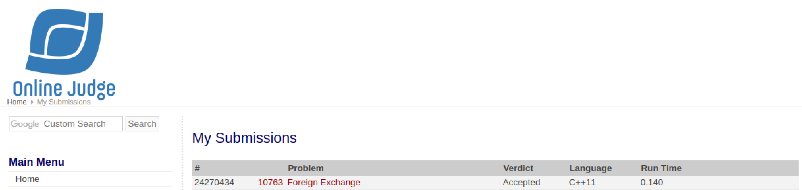

# [Foreign Exchange](https://onlinejudge.org/external/107/10763.pdf)

## Veredito do Código



## Respostas

Gabarito dos inputs fornecidos

### [Input 01](input1.txt)

Caso de teste retirado da própria questão

```txt
YES
NO
```

### [Input 02](input2.txt)

Caso de teste retirado do [uDebug](https://www.udebug.com/UVa/10763)

```txt
NO
NO
```

### [Input 03](input3.txt)

Caso de teste retirado do [uDebug](https://www.udebug.com/UVa/10763) (adaptado)

```txt
YES
NO
NO
NO
NO
NO
YES
```
