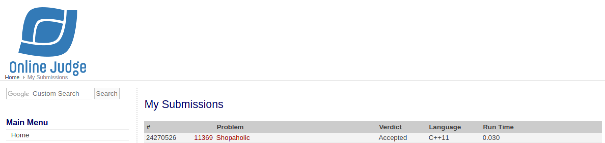

# [Shopaholic](https://onlinejudge.org/external/113/11369.pdf)

## Veredito do Código



## Respostas

Gabarito dos inputs fornecidos

### [Input 01](input1.txt)

Caso de teste retirado da própria questão

```txt
400
```

### [Input 02](input2.txt)

Caso de teste retirado do [uDebug](https://www.udebug.com/UVa/10763) (adaptado)

```txt
868
2640
2552
3087
1466
2508
1403
3245
539
2756
3638
```

### [Input 03](input3.txt)

Caso de teste retirado do [uDebug](https://www.udebug.com/UVa/10763)

```txt
66876544
66894841
67522586
66732001
66796263
67036652
66419356
66518628
66202517
66653994
66592576
66971373
66842512
66495347
66278422
66593318
66183226
66761262
66701226
67107502
```
